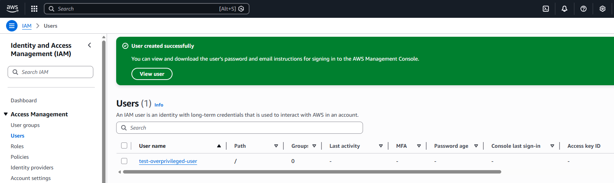
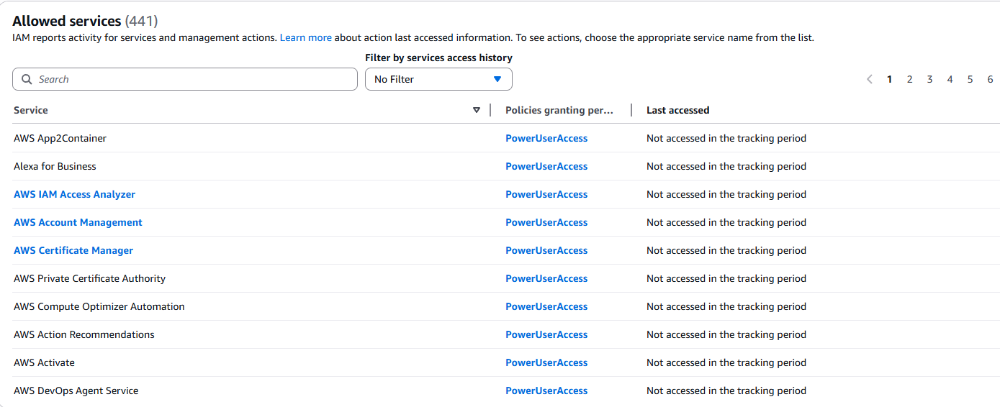
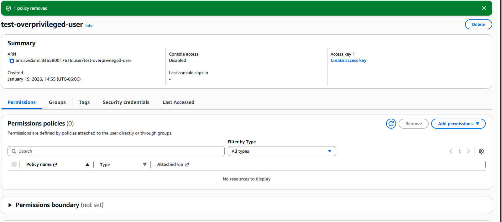
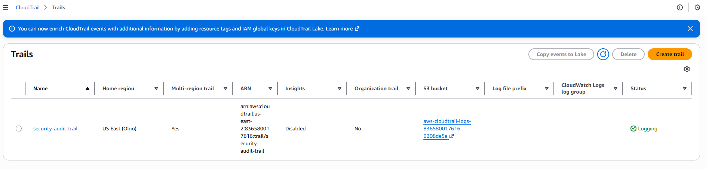
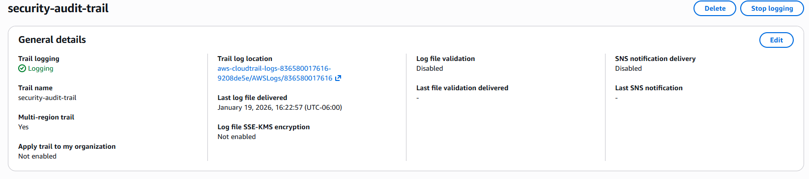

# AWS IAM Lab – Least Privilege & IAM Permissions

## Lab Overview
This lab shows my process of managing IAM users, detecting excessive permissions, and applying the principle of least privilege in AWS. The purpose of this lab is to identify users with too many privileges and remediate their access.

---

## Lab Steps

### 1. Created Test User
- **User name:** `test-overprivileged-user`
- **Initial permissions:** `PowerUserAccess` (intentionally overprivileged)
- **Screenshot:**

---

### 2. Access Advisor Review
- Access Advisor was used to identify services that were **not accessed** by `test-overprivileged-user`.
- This helps determine which permissions can be safely removed.
- **Screenshot of unused services:**

---

### 3. Permissions Removed
- Unnecessary permissions were **removed** from `test-overprivileged-user` to enforce least privilege.
- **Screenshot after removing permissions:**

---

### 4. CloudTrail Setup (Auditing)
I created a CloudTrail called `security-audit-trail` it was created for auditing IAM activity:

CloudTrail configuration:

- **Multi-region:** Enabled  
- **Apply trail to my organization:** Not enabled  
- **Log location:** `aws-cloudtrail-logs-836580017616-9208de5e/AWSLogs/836580017616` 
- **Last log file delivered:** January 19, 2026, 16:22:57 (UTC-06:00)  
- **Encryption (SSE-KMS):** Not enabled  
- **Log file validation:** Disabled  
- **SNS notifications:** Disabled  

> Since this lab used a test user that did not perform actions, no events were recorded. The purpose of the cloudtrail was to create a simulated investigation if I were to perform these IAM changes in a real world scenario. This demonstrates knowledge of setting up CloudTrail for auditing and security monitoring.  

**Screenshots of CloudTrail configuration:**  
  

---

## Summary
This lab shows how I:

- Created and manage IAM users in AWS.  
- Identified overprivileged users.  
- Apply the principle of least privilege by removing unused permissions.  
- Set up CloudTrail to monitor and audit IAM activity.

