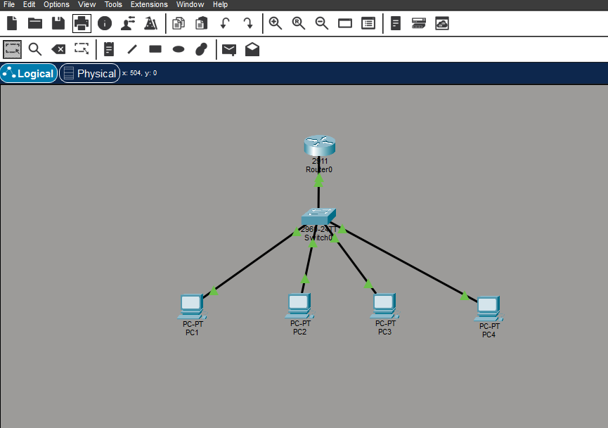
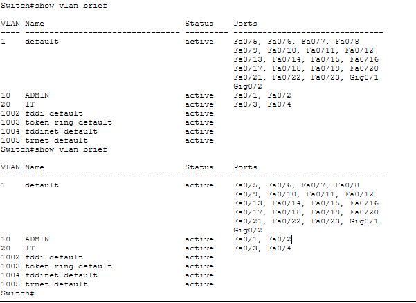
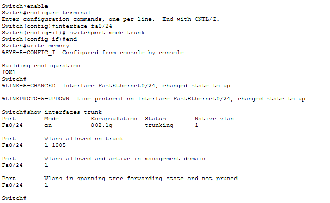
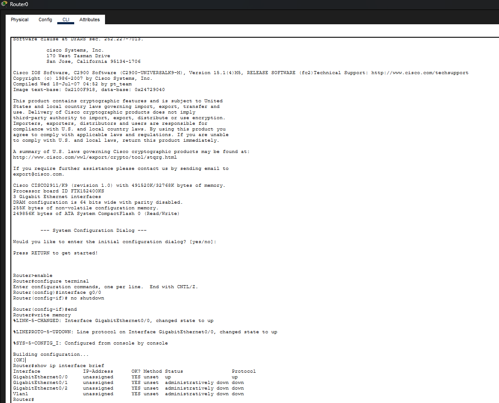
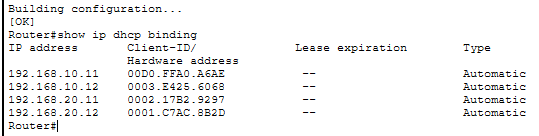
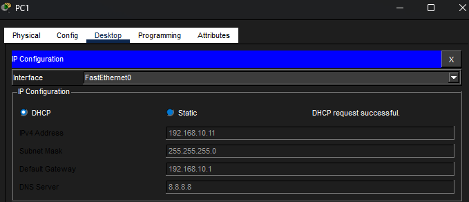
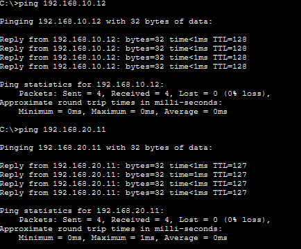
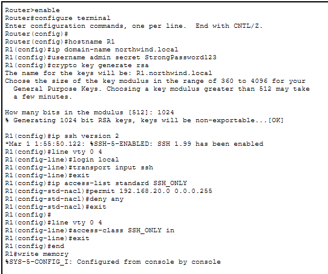
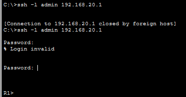
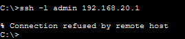

# CISCO Packet Tracer Lab with VLAN, Inter-VLAN Routing, DHCP, and SSH Security Lab

## Overview
In this project I was tasked withing setting up a small enterprise network, built using Cisco Packet Tracer. This network includes VLAN segmentation, inter-VLAN routing, DHCP configuration, and secure SSH remote administration with access control restrictions.

---

## Network Topology Overview

The following image shows intial layout of the network environment in Cisco Packet Tracer, including all devices and connections used in the lab.

---

## Network Setup

- 1 Router 
- 1 Switch 
- Copper Cable Connections
- 4 PCs
- VLAN 10 (Contains ADMIN network)
- VLAN 20 (Contains IT network)

---

## Key Configurations

### VLAN Configuration
- VLAN 10 → PC1, PC2
- VLAN 20 → PC3, PC4

### Inter-VLAN Routing
Configured using router subinterfaces:
- g0/0.10 → 192.168.10.0/24
- g0/0.20 → 192.168.20.0/24

### DHCP Configuration
- DHCP pools configured for both VLANs
- Automatic IP assignment enabled for all four PCs

### Switching
- Access ports assigned per VLAN
- Trunk link configured between switch and router

### SSH Security
- SSH enabled on router
- RSA key generation completed
- Local user authentication configured
- SSH access restricted to VLAN 20

---

## Verification Tests

The following tests were performed to confirm functionality.

### VLAN Verification
- Verified correct VLAN assignment using `show vlan brief`

### Trunk Verification
- Confirmed trunk link using `show interfaces trunk`

### Router Verification
- Confirmed subinterface status using `show ip interface brief`

### DHCP Verification
- Confirmed IP assignment using `show ip dhcp binding`

### Connectivity Tests
- PC1 successfully pinged PC2 (same VLAN)
- PC1 successfully pinged PC3 (inter-VLAN routing)
- PC3 successfully pinged PC4 (same VLAN)
- PC3 successfully pinged PC1 (inter-VLAN routing)

### SSH Tests
- SSH access successfully allowed from VLAN 20
- SSH access denied from VLAN 10 (ACL enforcement)

---

## Screenshots

### Network Overview

### VLAN & Switching

#### VLAN Configuration

#### Trunk Port Configuration

### Routing & DHCP

#### Router Interface Status

#### DHCP Bindings

#### PC DHCP Configuration

### Connectivity Testing

#### Ping Tests from PC1

### SSH Configuration & Security

#### Router SSH Configuration

#### SSH Success from VLAN 20

#### SSH Refused from VLAN 10

---

## Concepts Learned

- VLAN creation and segmentation
- Inter-VLAN routing 
- DHCP configuration 
- Trunking
- Secure remote management using SSH

---

## Summary

This labs demonstrates a fully functional segmented network with secure administrative access and dynamic IP allocation. It simulates a small enterprise environment with separation of Admin and IT departments.

---
