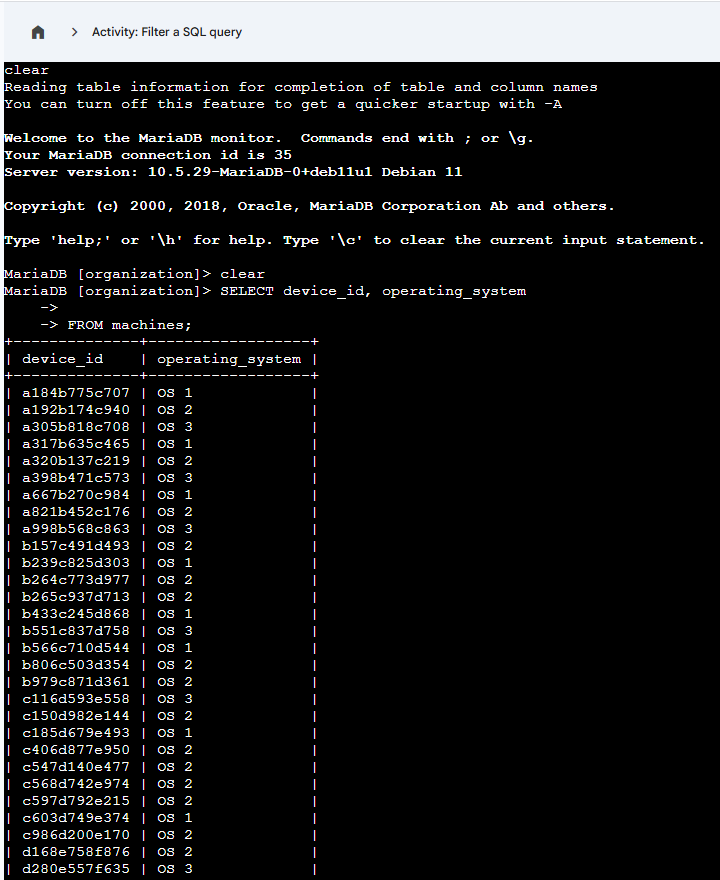
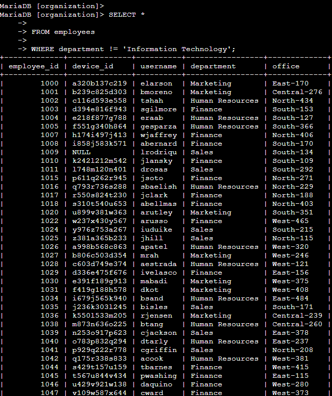
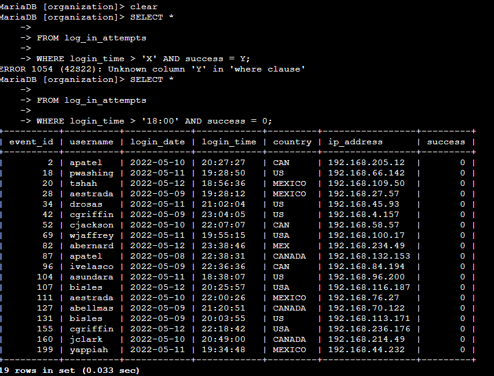
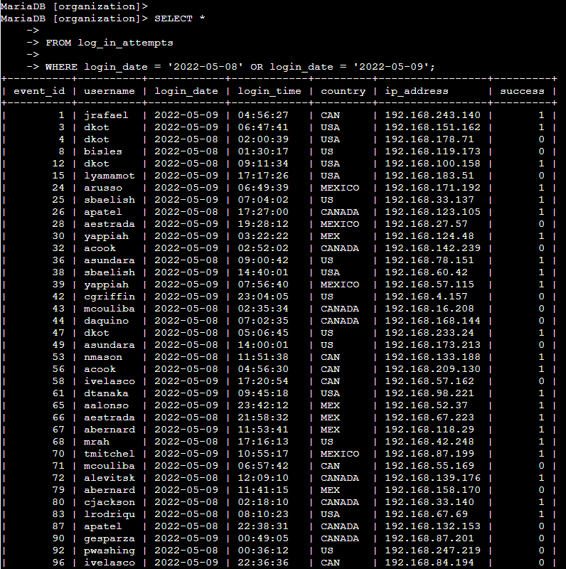
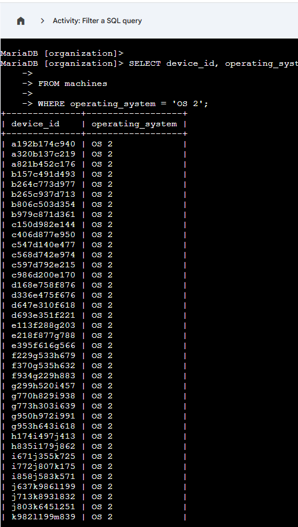

# Database and SQL
Data security, queries, filtering and database related security.

## Database Systems & SQL Query Exercises

This section highlights my experience working with SQL querying, filtering, and logical operators in various labs. In these labs I needed to analyze employee, device, and login data to investigate a potential breach within an organization

---

### Employee Office Location Filtering
Implemented SQL queries to filter employee records by office location using cardinal directions (N, S, E, W)

---

### Device and Operating System Filtering
Filtered machine records by device ID and operating system to support asset tracking and system inventory analysis.

---

### Employee Department Exclusion `NOT`
Filtered employee records to exclude a specific department using the NOT operator. This helps focus analysis on relevant departments while ignoring others.

---

### Login Attempt Analysis `AND`
Demonstrates using AND, OR, and NOT operators to filter login attempts by time, success, or department.

---

### Login Date Filtering with `OR` Conditions
Shows how OR logic is used to analyze login attempts occurring on multiple specific dates.

---

### Sorted Login Attempt Queries
This image below shows ordering login attempt records by date and time to support timeline analysis during investigations.

---

### Operating System Specific Device Queries
This image below shows a database query which retrieves device IDs and operating systems filtered by a specific OS value.

---

## Skills I learned

- SQL SELECT statements
- WHERE filtering
- AND / OR / NOT logical operators
- Pattern matching with LIKE
- Sorting results with ORDER BY
- Asset and authentication data analysis
- Security-focused query logic

---

## Use Cases

- Security log analysis
- Asset inventory and OS tracking
- Authentication monitoring
- Incident investigation support
- Internal Audits

