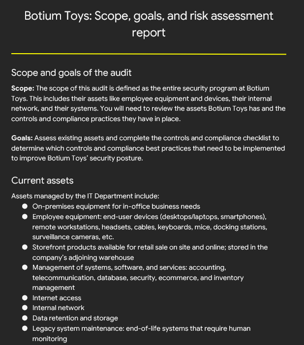
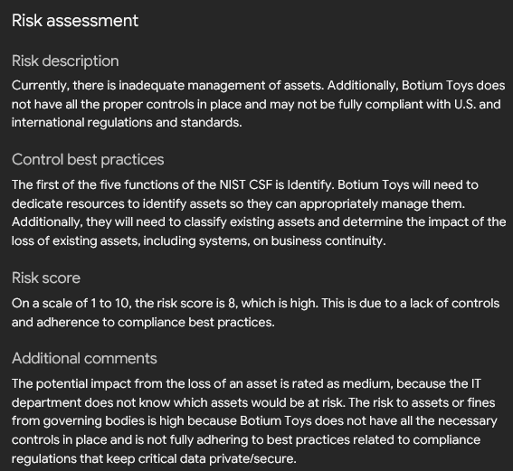
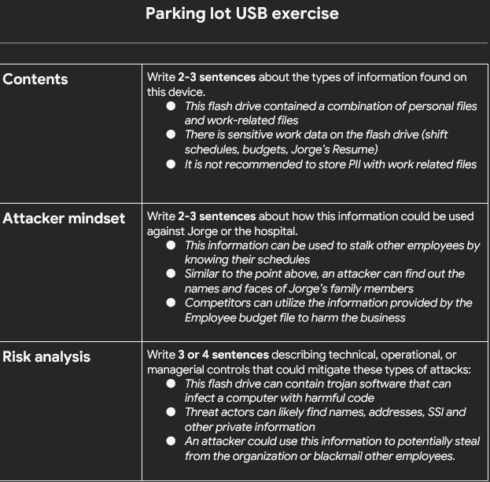
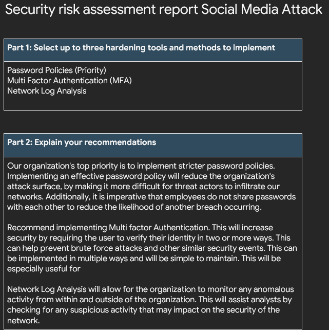

# Governance, Risk and Compliance (GRC)
This file contains simulated risk assessments, audits and security control evaluations.

### Risk Assessment Overview
Summary: In the image below I conducted an internal IT audit for a fictional company called Botium Toys to assess the company’s assets, existing security controls, and compliance with relevant regulations and standards. The findings were used to complete a controls and compliance checklist and identify gaps impacting the company’s security posture. I documented clear recommendations to help the organization strengthen controls, improve compliance, and support business continuity.
### Risk Assesment 1

### Risk Assesment 2

---

### USB Audit & Asset Handling 
Summary: In the image below, I conducted an audit about the security risks associated with a USB drive that was found on the ground outside a hospital. In this scenario I analyzed the contents of the usb drive from both an attacker’s and defender’s perspective. This scenario focused on understanding how USB baiting attacks can be used to deliver malware and compromise organizational systems.  I assessed the potential risks, mindset of attackers and provided recommendations in order to prevent damage to hospital networks and assets.

---

### Social Media Security Risk Analysis
Summary: In this activity, I analyzed a simulated social media based attack scenario where an organization’s online presence was targeted to gain unauthorized access and distribute malicious content. The scenario focused on identifying the best hardening tools and methods to better protect the organization. I recommended a number controls, including stronger authentication, network log monitoring, and improved password policies to reduce the organization's attack surface.

