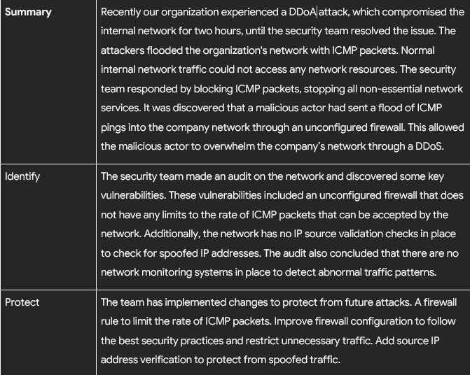
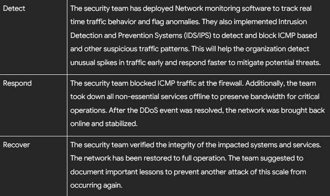
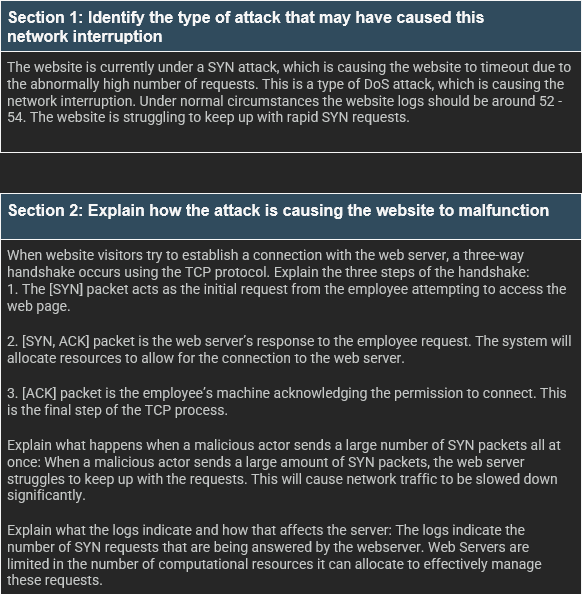

# Incident Response
This folder contains various incident response reports and analysis.
Summary: The images below demonstrate a simulated DDoS attack against a large multimedia company that provides design, graphic design and social media marketing services. The attack used an ICMP flood to overwhelm network resources, which resulted in service outages that impacted client facing platforms. These images show an incident analysis report I made using the NIST cybersecurity framework to improve the organization's security posture.

### DDoS Image Part 1

### DDoS Image Part 2

### Network Traffic Analysis
### 
Summary: In the image below, I analyzed a simulated DNS issue. In the scenario several customers reported being unable to access the website www.yummyrecipesforme.com. Analysis of tcpdump logs showed that DNS requests sent over UDP to port 53 were failing. The  ICMP responds with the message  “port unreachable” error. This indicated that the DNS service was unavailable or misconfigured, which explains why users could not access the website. In the images I analyzed the potential causes of the DNS disruption.
###

### SYN Attack Analysis
### 
Summary: In the image below I investigated a suspected attack on a fictional travel agency website, where employees and customers are unable to access the sale page due to a connection timeout. Using Wireshark (Packet Sniffer Program) I observed a flood of TCP SYN requests from an unknown IP. This indicated a possible SYN flood attack which is overwhelming the web server. In the image below I documented the incident to alert our security manager for this scenario.
###

