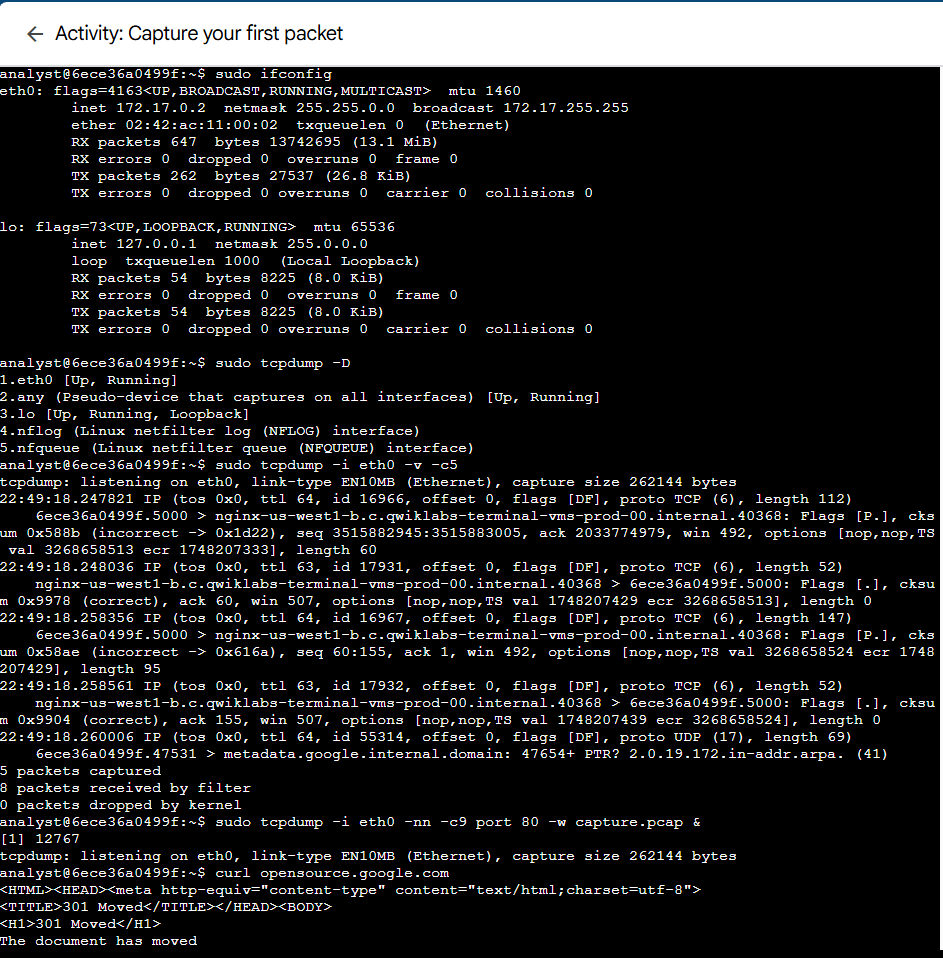
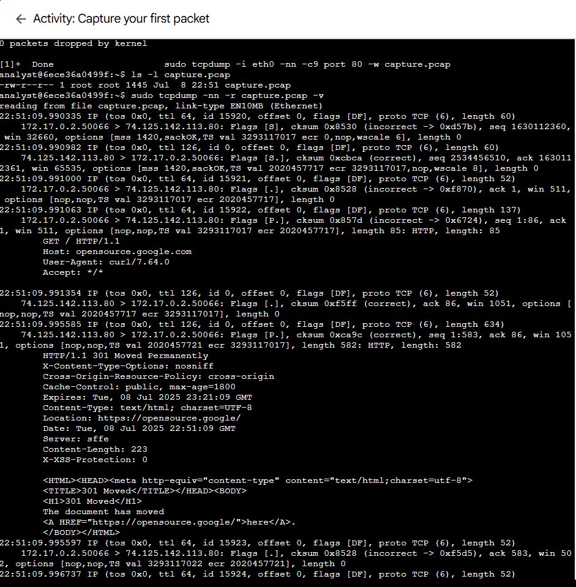
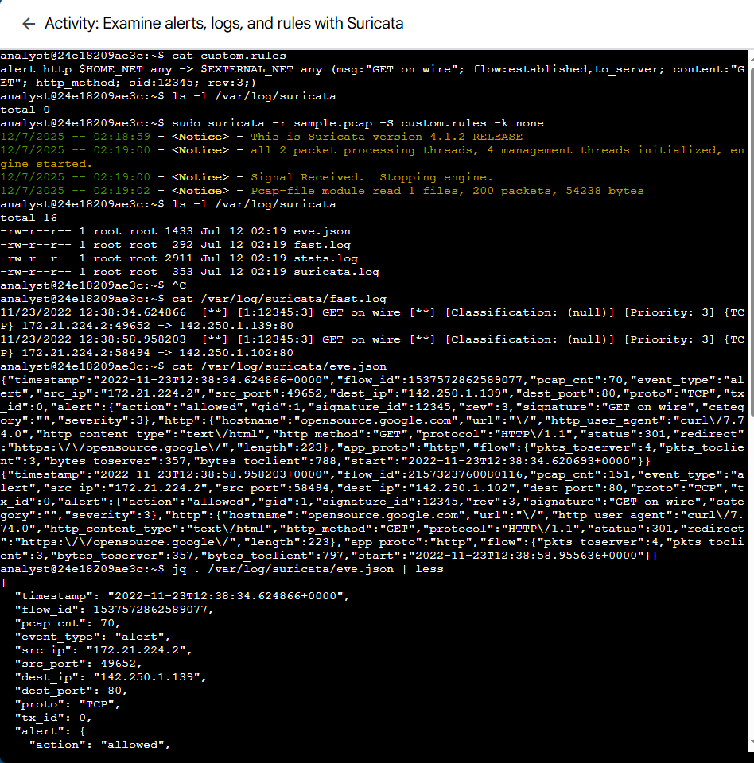
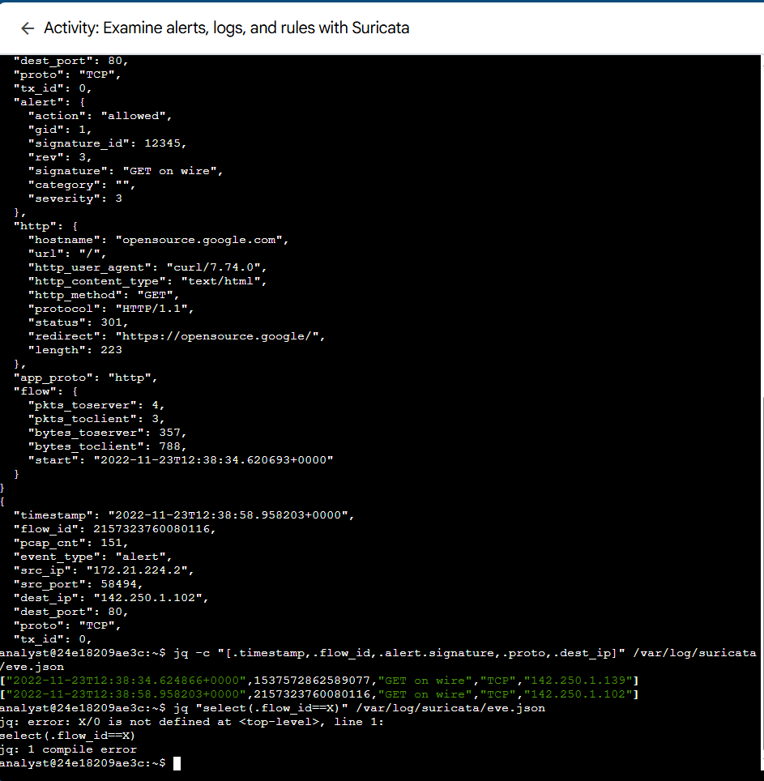

# Network Security
This file contains simulated network traffic analysis utilizing tcpdump, Suricata and Wireshark.

## Packet Capture Explanation

Captured and analyzed live network traffic using `tcpdump` on a Linux VM to understand packet structures and network interface activity. This lab focused on filtering traffic on the `eth0` interface and inspecting packet details such as source, destination, protocol, and flags. 

---

### First Packet Capture
Demonstrates capturing the first few packets from the `eth0` interface and inspecting key packet data.

---

### Detailed Packet Capture
This image shows a more detailed view of subsequent packets, including TCP flags, sequence numbers, and acknowledgment info.

## Suricata Network Monitoring Explaination 

Suricata is an open-source network threat detection engine that functions as an IDS/IPS and network security monitoring tool. It inspects network traffic in real time, detecting suspicious patterns, anomalies, and known threats using rules and signatures. The images below shows me using Suricata to monitor and analyze network packets for security events.

---

### Suricata Packet Capture 1
The image below shows the initial network traffic captured by Suricata.

---

### Suricata Packet Capture 2
In this image I examined alerts, logs and other important information captured with Suricata.

