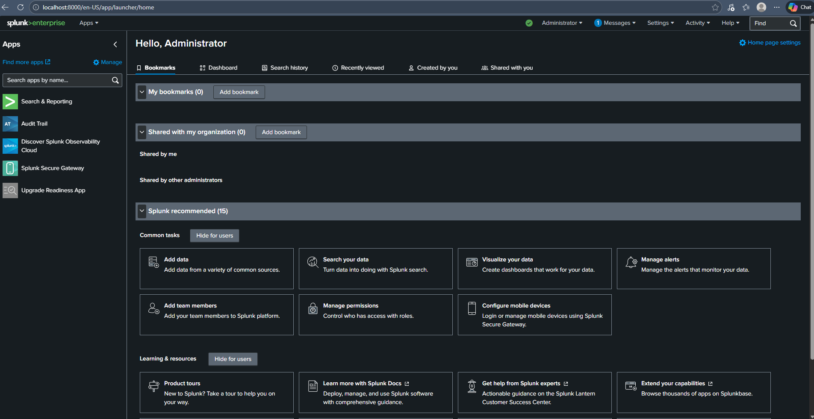
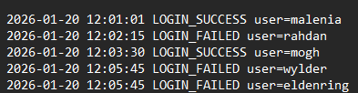
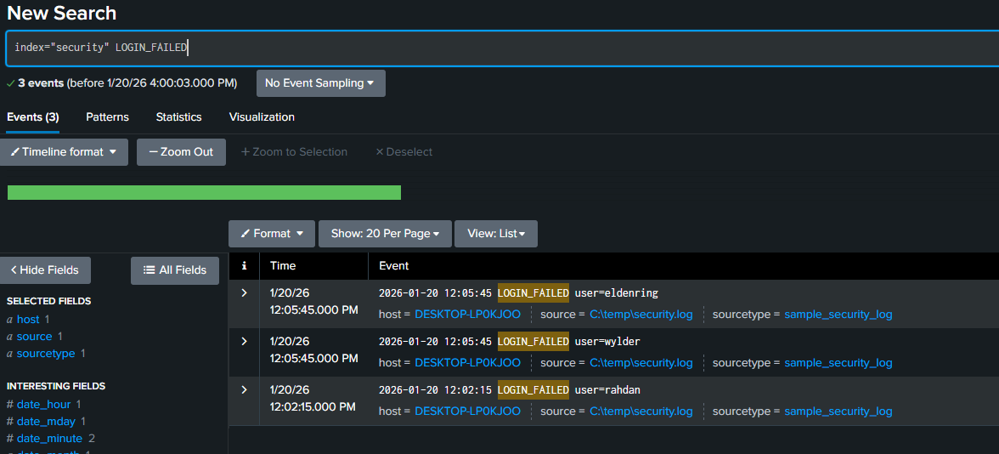
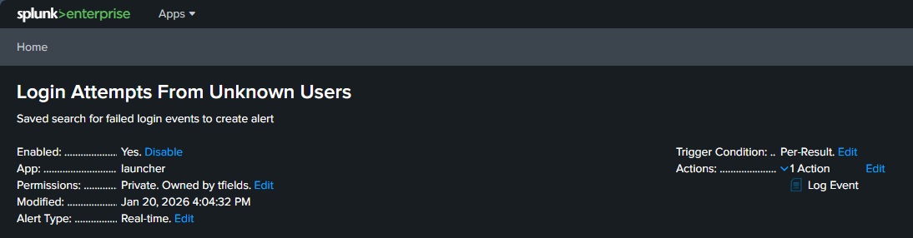
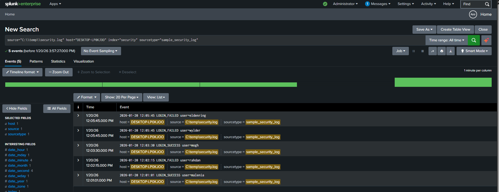

# Splunk Login Monitoring Lab

This lab demonstrates core Splunk skills for cybersecurity monitoring, including log ingestion, event filtering, alert creation, and event analysis using a simulated security log file. 

### Splunk Home
Summary: The main Splunk page shows access to apps, dashboards, and searches, providing the central interface for performing searches and managing data inputs. The purpose of this image was to show Splunk successfully installed.  

### Sample Security Log
Summary: In this security investigation a file called (`C:\temp\security.log`) contained information about successful and failed login attempts over a period of time. This log file was ingested into Splunk for analysis and alerting.  

### Failed Login Search
Summary: A search query was used to filter only failed login events in the security log. I used the query `index=security LOGIN_FAILED`. This shows basic SPL usage to isolate  particular events for monitoring.  

### Failed Login Alert
Summary: I created an alert called **Login Attempts From Unknown Users** was created from the failed login search. It triggers whenever failed login attempts are detected, runs on a schedule, and notifies users of suspicious activity.  

### Security Log Analysis
Summary: The security log was analyzed in Splunk with host `DESKTOP-LP0KJOO`, source `C:\temp\security.log`, and sourcetype `sample_security_log`. This image shows both successful and failed login events with timestamps.  

---

## Skills Demonstrated

- Data ingestion and index creation in Splunk  
- SPL search queries for event filtering  
- Alert configuration for failed login attempts  
- Log analysis and visualization of security events  

## Use Cases

- Security Operations Center (SOC) monitoring  
- User login auditing and tracking  
- Alerting on potential security breaches  
- Dashboard creation for operational insight  

