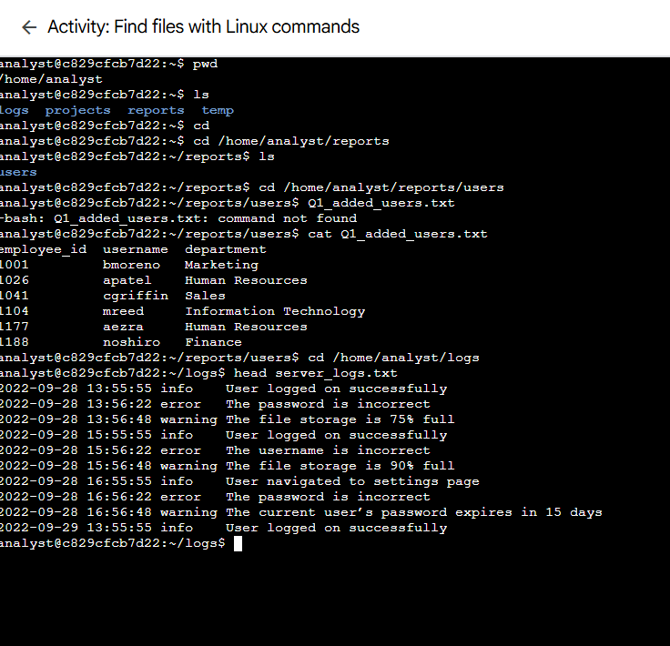
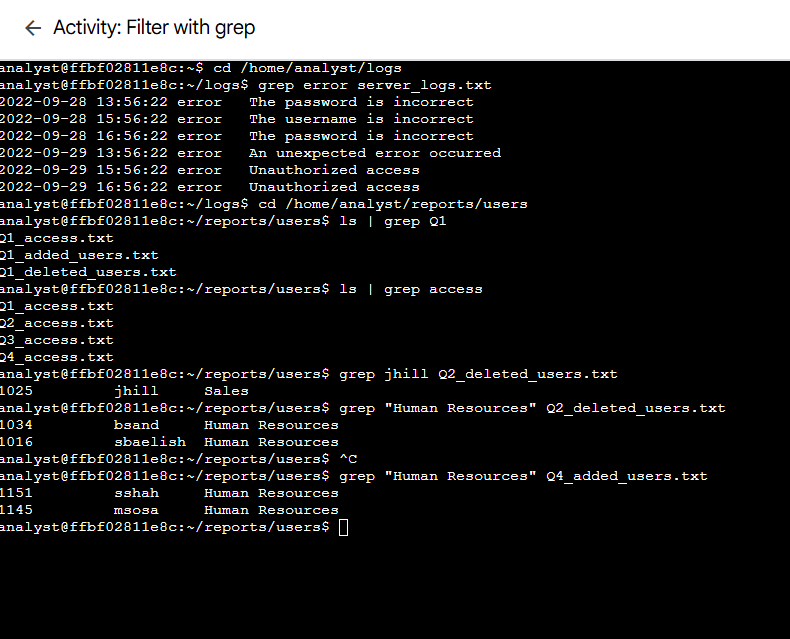
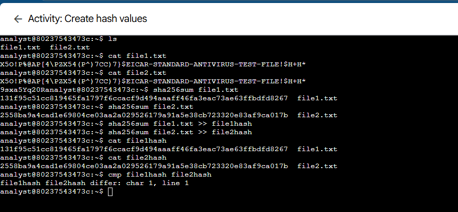

# Systems and Linux
This `README` contains screenshots from a variety of Linux labs I completed which focused on command line usage, access control, and file integrity.

---
### File Discovery with find
In this image I used the Linux commands to find out information about different users.

---

### Log Filtering with grep
In this image I filtered and analyzed logs using the `grep` command.

---
### Modifying file and directory permissions
This exercise shows changing read, write, and execute permissions for the owner, group, and others using the `chmod` command.

---

### File Decryption
In this exercise I decrypted protected files using Linux tools such as Caesar cipher decoding with `cat` and file decryption with `openssl`.

---
### Hash Creation and Integrity Checking
In the image below I created creating hash values utlizing `sha256sum`.

